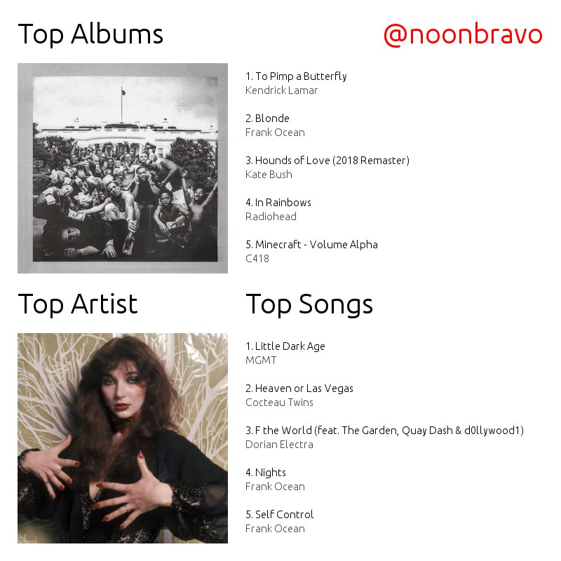

# scrobblesbot
Uses last.fm API to provide a weekly summary of listening habits, sent to a telegram channel of choice.

### Setup
Need a last.fm bot API and a telegram API. It is recommended to modify your host computer's crontab to run this script weekly.

### Example
If everything works properly, the image should look as such:

